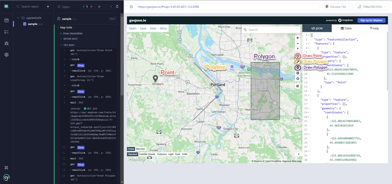

# geomaps-in-cypress
How to create Geometries with Ease (Points, Polylines, and Polygons) on a Geojson.io Sample Map using Cypress and the cypress-real-events Plugin.

For more details, please check out the article [Geo-Express: Whirlwind Guide to Mapping Geometries with Cypress and cypress-real-events plugin](https://dev.to/sebastianclavijo/geo-express-whirlwind-guide-to-mapping-geometries-with-cypress-and-cypress-real-events-plugin-k6o).

